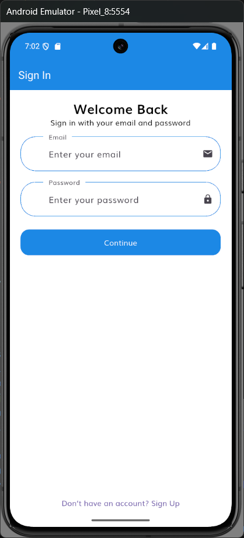
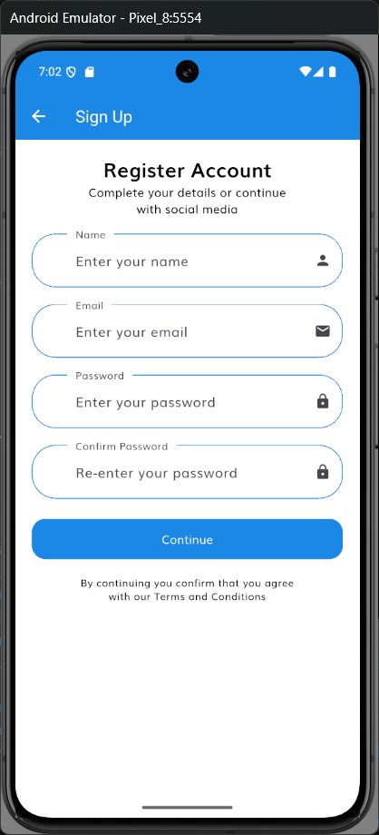
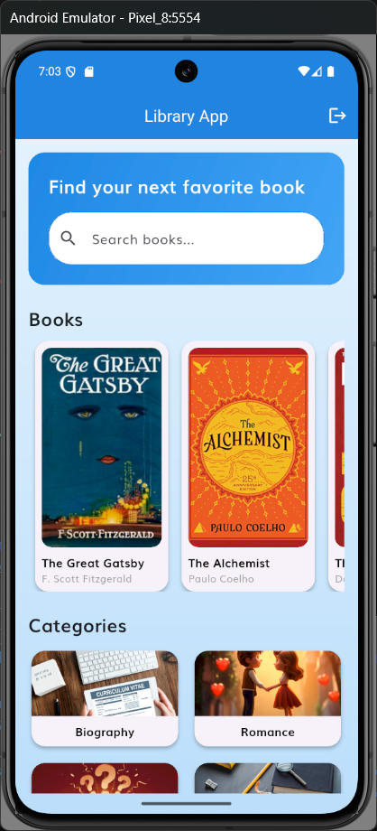
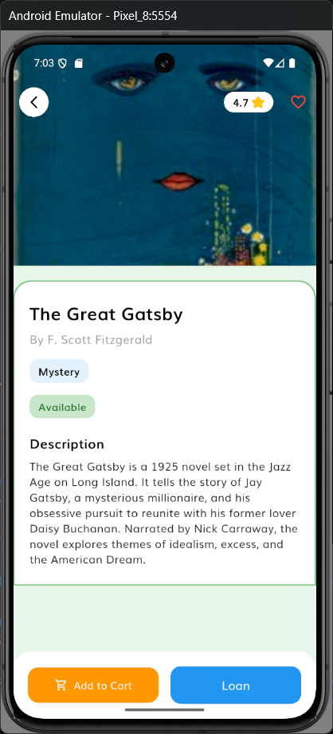
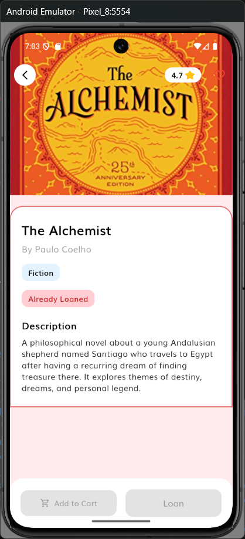

# Flutter Library App with Firebase

A Flutter-based Library App featuring **Firebase Authentication** and **Firestore** integration. This app supports both **user** and **admin** roles, enabling book browsing, management, and real-time data updates.

## Features

### User Features

* Browse available books and categories
* View book details
* Search and filter books
* Personalized experience based on authentication

### Admin Features

* Dashboard showing statistics (Users, Books, Categories)
* Add, edit, and delete books
* Manage categories
* View previews and full lists of collections
* Secure logout

### Firebase Integration

* Firebase Authentication (Email & Password)
* Firestore database for storing users, books, and categories
* Real-time updates and data validation

## Screenshots

| Login Screen                                  | Signup Screen                                   | Home Screen                                 |
| --------------------------------------------- | ----------------------------------------------- | ------------------------------------------- |
|  |  |  |

| Book Details                                                | Loaned Book Details                                                       |
| ----------------------------------------------------------- | ------------------------------------------------------------------------- |
|  |  |

## Installation

1. Clone the repository:

```bash
git clone https://github.com/your-username/flutter-library-app.git
```

2. Navigate to the project directory:

```bash
cd flutter-library-app
```

3. Install dependencies:

```bash
flutter pub get
```

4. Configure Firebase:

   * Create a Firebase project
   * Enable Authentication and Firestore
   * Add `google-services.json` (Android) and `GoogleService-Info.plist` (iOS)

5. Run the app:

```bash
flutter run
```

## Project Structure

```
lib/
├─ constants.dart          # App constants
├─ controllers/            # State management controllers (Books, Categories)
├─ models/                 # Data models (Book, Category)
├─ views/
│  ├─ auth/                # Authentication screens
│  ├─ home/                # User home screens
│  ├─ admin/               # Admin dashboard and management
│  └─ splash/              # Splash screen
└─ main.dart               # App entry point
```

## Dependencies

* Flutter SDK
* Firebase Core
* Firebase Auth
* Cloud Firestore
* Provider (State Management)

## Contributing

1. Fork the repository
2. Create a new branch (`git checkout -b feature-name`)
3. Commit your changes (`git commit -m 'Add new feature'`)
4. Push to the branch (`git push origin feature-name`)
5. Open a Pull Request

## License

MIT License

---

**Developed by Louay Amor**

* GitHub: [https://github.com/louayamor](https://github.com/louayamor)
* LinkedIn: [https://www.linkedin.com/in/louayamor](https://www.linkedin.com/in/louayamor)
